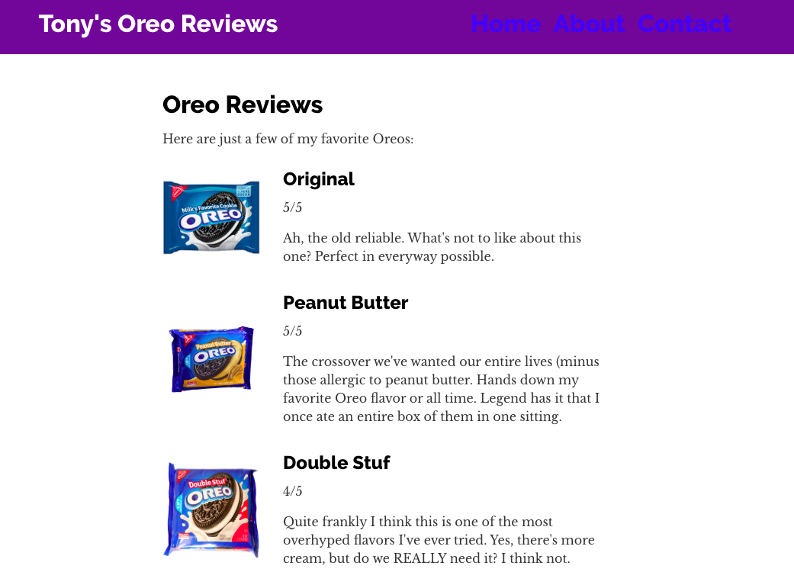

# Oreo-Review-App

## Preface

The following application was made as part of an assignment for the coding bootcamp I'm in. 

The task was to learn one language, framework, or technology that was not taught in the class and implement it in a day. I chose [GatsbyJS](https://www.gatsbyjs.org) as it was something one of my instructors mentioned would make for a good tool for a side-project I was thinking of.

For those unfamiliar with the webdev tool that is GatsbyJS, it is essentially a static-site generator based on React and powered with GraphQL. One of the things that seems to make GatsbyJS so great is that because it is built on GraphQL, it builds a data layer. Allowing us to pull data from just about anywhere pretty quickly. 

It is a super developer-friendly tool and has some of the best documentation and tutorials I've found when learning about a new technology.

## About this Project
This application is meant to archive all the Oreos I've eaten and along with a rating and review for each flavor I've had. As of right now, the current data is a bit sparse and was just used as an MVP for my assignment. Here is a screenshot of what the final proof of concept looks like.

## Future Work
There are a ton of different things I'd like to do with this project. Here are some coming down the pipeline:
- Add styling (there's still quite a few remenants of the Gatsby starter code in my project)
- Add full CRUD functionalities for this project (currently it is just static data)
- Find a database / API that actually can pull information on Oreos (particularly with flavor and picture).

## Reflection (Assignment Requirements)
I really enjoyed this project and felt that it gave me a pretty good insight on a tool to add to my "quiver" of webdev tools. GatsbyJS has some amazing documentation and even step-by-step tutorials from setting up your developer environment to some really advanced topics like source plugins and user authentication. This is definitely something I can see myself using in the future.

I think for the time I alotted myself to actually learn and code today, I pretty much expected to be able to have a makeshift Gatsby application. For all intents and purposes, I feel like I accomplished that. My reach goal would've definitely been to add full CRUD functionality rather than having static data, but I personally prioritized learning how to manipulate the tools GatsbyJS provides and how I can possibly use it for future websites I make.

## dev.to 
A full write-up blog post for this project is still in the works! In the meantime, feel free to read my most recent [blog post](https://dev.to/tonyxgao/a-college-graduates-3-month-reflection-into-the-full-time-workforce-1l29) about my thoughts of work and post-grad life.

